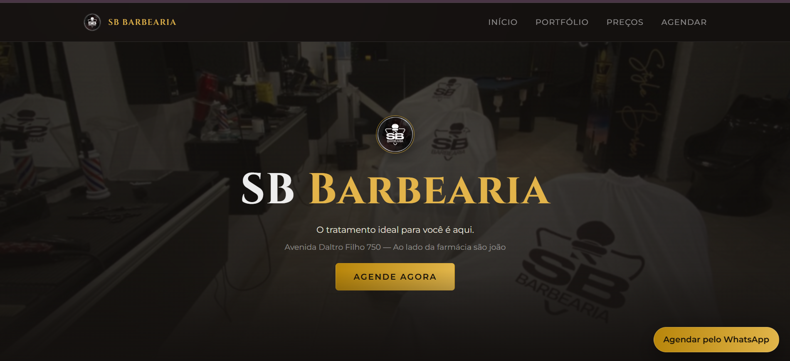
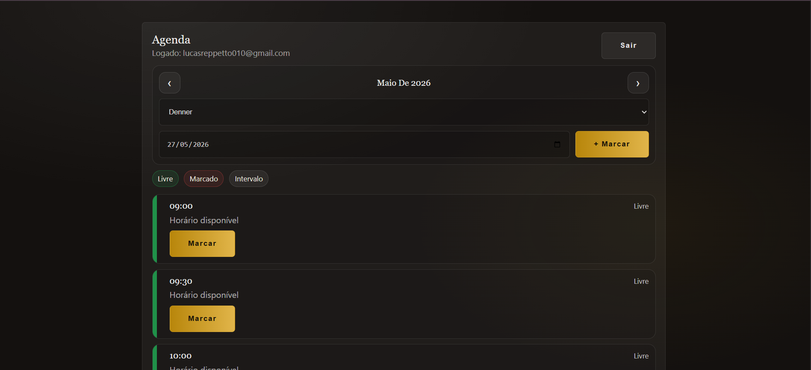

# 💈 SB Barbearia — Site + Agendamento em Tempo Real (Firebase)

Projeto do site da **SB Barbearia** com páginas públicas e **sistema de agendamento em tempo real**, incluindo **painel administrativo (barbeiros/admin)** com login, visualização da agenda por barbeiro e recursos para **marcar e desmarcar horários manualmente**.

---

## ✨ Funcionalidades

### 🌐 Site público (cliente)
- ✅ Landing page completa (Home, Sobre, Portfólio, Nosso Espaço, Preços, Localização)
- ✅ Agendamento em tempo real:
  - Escolha de **barbeiro**
  - Escolha de **data**
  - Lista de horários de **30 em 30 minutos**
  - Horários **disponíveis** e **indisponíveis** atualizados em tempo real
- ✅ Confirmação pelo **WhatsApp** com mensagem pronta

### 🔐 Painel do Barbeiro/Admin (com login)
- ✅ Login via **Firebase Authentication (Email/Senha)**
- ✅ Seletor dos **3 barbeiros**
- ✅ Agenda em formato de cards (estilo app)
- ✅ Mostra horários:
  - **Livres** 🟩
  - **Marcados** 🟥 (com dados do cliente)
  - **Intervalo** ⬜ (também pode marcar manualmente)
- ✅ Ações:
  - ➕ **Marcar horário** manualmente (admin)
  - ❌ **Desmarcar horário** (cancelar agendamento)
- ✅ Atualização **em tempo real** via Firestore

---

## 🧰 Tecnologias utilizadas

### ✅ Front-end
- **HTML5**
- **CSS3**
- **JavaScript (ES Modules)** — sem frameworks

### ✅ Backend / Tempo real
- **Firebase Firestore** (banco de dados em tempo real)
- **Firebase Authentication** (login e controle de acesso)

### ✅ Integrações
- **WhatsApp Link (wa.me)** para abrir conversa com mensagem predefinida
- **Google Maps Embed** para localização
- 
## 📱 Responsivo (Responsive)
O site foi desenvolvido com **layout responsivo**, adaptando-se automaticamente para:
- 📱 Celulares
- 📟 Tablets
- 💻 Desktop

A navegação e os componentes (cards, tabelas, formulário de agendamento e painel) ajustam grid, espaçamentos e fontes conforme o tamanho da tela.
  
## 📸 Preview

## 📸 Preview

